# itd-git-intro
This is a guide for DCP's ITD trainings focused on setting up Git and practicing Git workflows.

### [Click here for the Hackathon Guide](https://docs.google.com/document/d/1qVKrJmOL1Qva_WXcC_p6XSeTseeNF03mwVH9-IxvE84/edit?usp=sharing)

## Prerequisite computer setup for Git on Windows 10
1. "Type to search" → "Default app settings"
2. Click on the icon under "Web Browser" and select Google Chrome from the options. Then close out of the settings window.
1. "Type here to search" → "Edit the system environment variables"
2. In the window that pops up, click the "Environment Variables..." button
3. In "System Variables" section, select "PATH" and then click "Edit"
4. Add new variables:
    - `C:\Program Files\Git\bin\`
    - `C:\Program Files\Git\cmd\`
5. Click okay until all windows are closed
6. "Type here to search" → "Command Prompt"
7. Run `git init` in the Command Prompt. This should give you a success message saying you've successfully initialized a repository.
4. Run `git config --global user.name "Your Name"`
5. Run `git config --global user.email you@example.com`

## Practicing the Git work flow
1. Create a new repository in your personal GitHub account
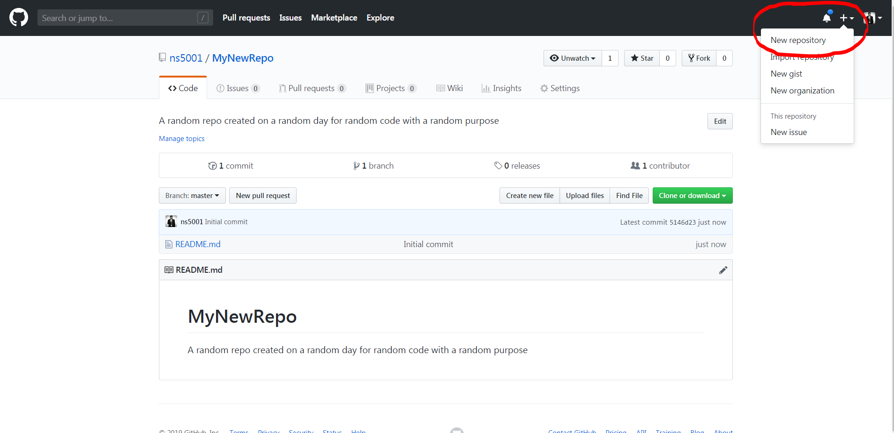
2. Click the "Clone or download" button and copy the HTTPS link
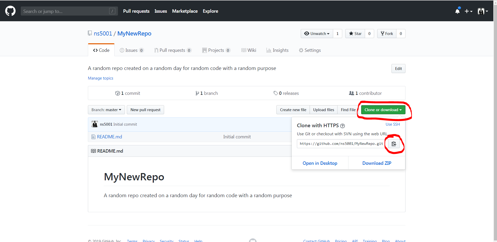
3. Now open the Command Prompt. For Windows 10: "Type here to search" → "Command Prompt"
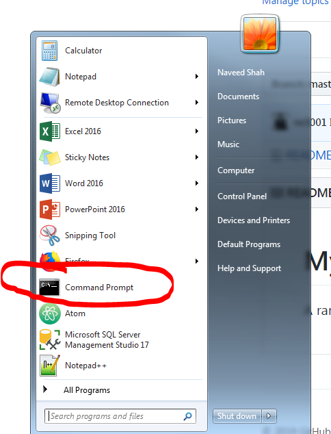
6. Run `dir` to list the files in your current user folder
7. Run `git clone https://github.com/youraccount/yourrepo.git` using the actual HTTPS link you just copied from the GitHub website
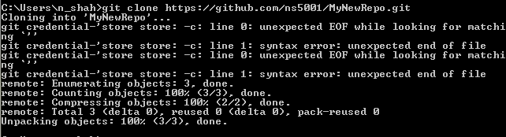
8. Run `dir` again to see that a folder for repo you just cloned is now in the list
9. Run `cd yourrepo` to navigate into the repo folder
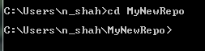
10. Run `atom .` to open all the repo folder content in the Atom text editor
11. Add some text inside the README.md file. Ex: "Hello World, I'm learning how to use Git!"
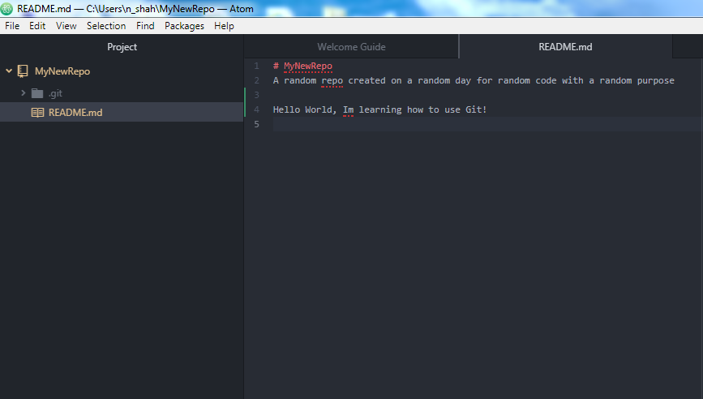
12. Save your changes to the README.md file and go back to the Command Prompt
13. Run `git status` to compare the content of your local repo against the "master" repo on GitHub. Git will tell you that you have "Changes not staged for commit" and tell you the name of the modified file that differs shown in red.
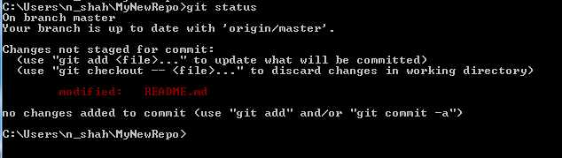
14. Run `git add .` to add your changed files to the Git tracking
15. If you run `git status` again, you'll see that your README file is now listed under "Changes to be committed" and shown in green.
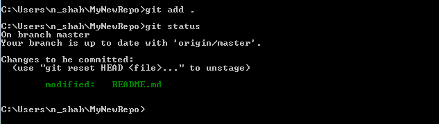
16. Run `git commit -m "message explaining what changes you made to the code"` to package up your changes into a "commit" with an explanation of your changes and the reasoning behind them. This is important for version control and understanding what was changed and why. `-m` stands for message.
17. If you run `git status` again, you'll see that you now have "nothing to commit, working tree clean"
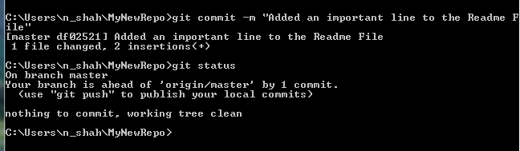
18. Run `git push origin master` to push your commit to the remote "master" repository on GitHub.
19. A popup window will appear prompting you to login to GitHub. Login then go back to the Command Prompt.
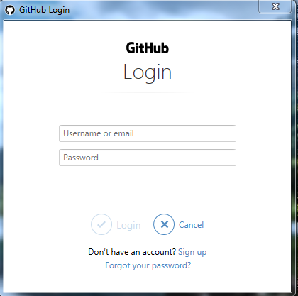
19. After a second or two, you should receive a success message. Now you can git back to the GitHub website, refresh the page, and see that your new change and "commit" message will appear.
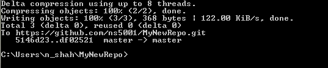
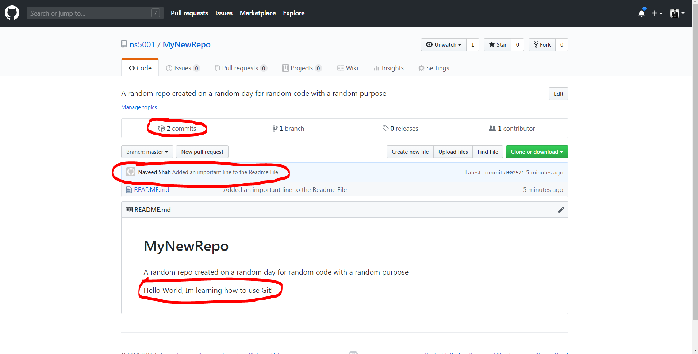

## Reminders of best practices when collaborating with others on an existing repository
- Each repo should contain a production branch (`master`), staging branch (`develop`), and individual branches for new features or bug fixes. You should do your work on a new branch and avoid making changes directly to master or develop.
- After you've already cloned the repo, always `git pull` the latest work from the remote repo before you start making new changes.
- Frequently merge in changes that have been implemented on `develop` into your own working branch to avoid future merge conflicts.
    - `git checkout develop` (this moves you onto the develop branch)
    - `git pull origin develop` (this pulls the latest work on develop from the remote repo)
    - `git checkout yourbranch` (this moves you back to your branch)
    - `git merge develop` (this merges the latest work from develop into your branch)

## Git commands for checking / adding / removing remote repository connections
- `git remote -v` to view the remote repositories you are connected to
- `git remote add origin <insert link to repo>.git` to connect code on your computer to an online repository
- `git remote rm <name of remote repo>` to remove an online repository

## Git commands for creating a new branch of switching between branches
- Creating a new branch: `git checkout -b newbranchname`
- Switching to another existing branch: `git checkout branchyouwant`

## Dealing with merge conflicts
Sometimes merging code is thwarted because Git detects different content in the same lines of code that it can't automatically reconcile. This is called a "merge conflict." Outlined below are some steps for resolving merge conflicts on your local computer via the command prompt and text editor.
1. Look closely at the merge conflict message in the Command Prompt. It will tell you which files contain conflicts.
2. In Atom, open each file containing the conflicts.
3. Search the text for the word "HEAD." Git flags sections of the code that have conflicts with HEAD and <<<<<< carrots. 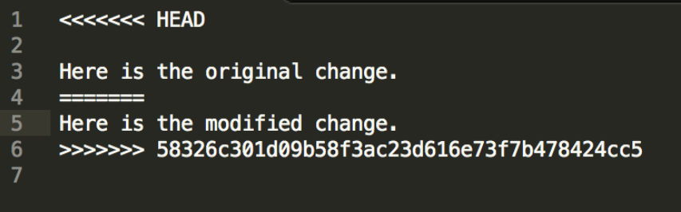
4. Review the section of code demarked by HEAD and a several <<<<<<< and edit the file so that only the desired code remains. Sometimes this requires talking to your colleagues whose code is conflicting with yours to confirm which version is right.
5. Keep searching for other instances of "HEAD" and cleaning up the code until "HEAD" can no longer be found in any of the files.
6. `git add .` your changes
7. `git commit -m "resolve conflicts between yourbranch and branchyoumergedwith`
8. `git push origin yourbranch`

## Errors
Git has plenty of error messages for various scenerios that you may encounter. Here are some of them and how to fix them:
1. 
fatal: The current branch <branch name> has no upstream branch.
To push the current branch and set the remote as upstream, use

    git push --set-upstream origin <branch name>

It means that the current local branch has no "upstream". An "upstream" allows Git to know which branch on the Github repo you are trying to modify, by default. So if you try to do a "Git Push", your local Git knows which branch you are trying to push up to, without you having to specify such as in "Git Push origin master" which is explicitly stating to push up to the master branch of the repository on Github. To fix this, simply type in this command:

git branch --set-upstream <remote-branch>

## Reverting your code to an earlier version
Sometimes you'll make a mistake and want to revert to an earlier version of the code. This is an easy process, once you figure out which commit captures the version you want to revert to.
1. Look through the commit history on Github and identify which commit is the safe version you want to revert to.
2. Click on the commit and copy the unique commit ID. Ex: `f414f31`
3. Go back to the Command Prompt and run `git reset --hard f414f31`
4. You'll get a success message saying you have reverted to the version from that commit ID.

## Atom Server Setup (this allows you to locally serve your code and preview your web app)
1. Open Atom text editor
2. Click "Install a Package" on the "Get to know Atom!" pane
3. Click "Open Installer"
4. Search for "server"
5. Install "atom-live-server"
6. Once it finishes installing, you'll see atom-live-server listed under the Packages menu. When you select it, you'll see the option to "Start server"
